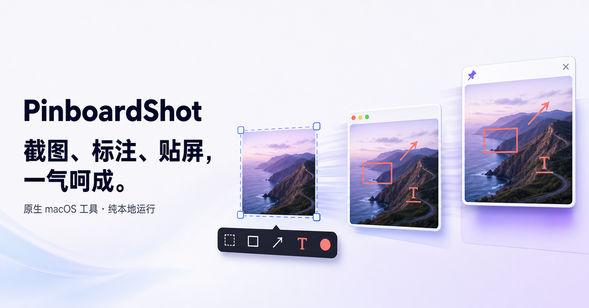

# PinboardShot

[中文](#中文) | [English](#english)



## 中文

PinboardShot 是一个纯原生、以本机处理为核心的 macOS 截图与贴图工具。它基于 AppKit、SwiftUI 和 ScreenCaptureKit；除软件更新外不发起网络请求，也不包含分析服务。

它的核心工作流很简单：截取屏幕内容，按需完成标注，然后把结果复制到剪贴板或贴在桌面最前方，继续当前工作。

### 当前能力

#### 截图

- 区域截图、当前屏幕截图、光标所在窗口截图
- 滚动截图：框选窗口内的可滚动区域，手动向下滚动时自动识别重叠内容并拼成长图
- 滚动截图期间在目标窗口右侧实时显示长图预览；预览窗口不会进入成品
- 区域截图后直接贴屏，以及从剪贴板创建贴图
- 3 秒延迟区域截图
- 区域截图时显示冻结的屏幕快照，避免 PinboardShot 自身遮罩和窗口进入成品
- 框选后可通过八个控制点继续调整选区；双击选区可直接复制
- 可选择是否在区域截图和全屏截图中包含鼠标指针
- 可关闭截图开始时的轻量进入动画
- 输出清晰度支持原生 Retina、720p、1080p、2K、4K 和 8K，默认使用 1080p
- 标准清晰度会保持宽高比，只在目标档位高于原图时放大，不会压缩已有原生像素

#### 截图标注

区域框选完成后可直接进入标注模式，无需先保存文件。当前支持：

- 马赛克、画笔、矩形、高亮、箭头和文字
- 自定义颜色和笔触粗细
- 撤销、重做与清除全部标注
- 已有文字可重新编辑、调整样式并拖动位置
- 标注结果可直接复制或贴到屏幕
- 标注先合成到原生裁图，再应用所选输出清晰度

#### 贴图

- 可同时创建任意多张贴图，并在所有桌面空间和全屏应用上方显示
- 拖动贴图移动位置，拖动窗口边缘或使用触控板双指捏合，可按原始宽高比自由缩放
- 可显示或隐藏全部贴图、关闭全部贴图，以及统一恢复鼠标交互
- 支持按贴图切换鼠标穿透
- 支持全局开启或关闭贴图阴影
- 右键贴图可放大、缩小、一键恢复首次贴屏时的位置/尺寸/交互状态，以及复制、保存、切换鼠标穿透或关闭

#### 快捷键与历史

- 快捷键中心支持新增、修改、删除和清除全部绑定
- 同一动作可以绑定多组快捷键
- 自动拒绝冲突或不安全的全局快捷键；普通字母组合必须包含 `⌘`、`⌥` 或 `⌃`，也可直接使用功能键
- 菜单会显示未能注册的快捷键，便于定位系统级冲突
- 自动保留最近 50 张截图，可查看尺寸与时间并重新贴屏
- 可手动清空历史，或选择在退出应用时自动清理

#### 系统集成与语言

- 菜单栏常驻，不占用 Dock
- 菜单栏图标支持静态或动态样式，并在设置中区分单色和彩色选项；系统启用“减弱动态效果”时动态图标保持静止
- 首次启动先说明菜单栏入口、快捷键默认关闭和权限用途，再由用户决定是否请求屏幕录制权限
- 支持登录时自动启动；需要系统确认时可直接打开“登录项”设置
- 界面语言支持跟随系统、简体中文、繁体中文和英文
- 所有截图、历史和偏好设置都保存在本机
- 通过菜单手动检查更新；设置中可开启自动检查，并选择每小时、每 6 小时、每 12 小时、每天、每 3 天或每周检查

### 快捷键

PinboardShot 默认不启用任何全局快捷键，避免占用其他应用的按键组合。可在“设置 → 快捷键”中为需要的动作主动添加快捷键，也可以为同一动作增加多组绑定。

支持直接使用功能键；普通字母组合必须包含 `⌘`、`⌥` 或 `⌃`。功能键是否需要同时按下 `fn`，取决于 macOS 的键盘设置。

### 基本使用

#### 区域截图与标注

1. 从菜单栏选择“区域截图”，然后拖动选择截图区域；如果已主动配置快捷键，也可用快捷键启动。
2. 如需微调，拖动选区边缘或角落的控制点。
3. 双击选区可立即复制；也可以使用工具栏进行标注、复制或贴屏。
4. 标注模式下选择工具、颜色和粗细，完成后复制或贴到屏幕。

按 `Esc` 或右键会取消截图。框选阶段在任何情况下都会于 12 秒后强制退出；选区完成并进入工具操作后，兜底时间会延长到 5 分钟，避免遮罩无限覆盖桌面。

#### 滚动截图

1. 从菜单栏选择“滚动截图”，然后框选某个窗口内部实际会随内容滚动的区域。
2. 框选结束后在原窗口内使用滚轮或触控板向下滚动；建议每次保留一部分可见内容，避免一次跨过整个画面。
3. 在右侧预览中确认拼接结果，完成后点击“完成”；结果会复制到剪贴板并保留到截图历史。

滚动截图适合网页、文档、聊天记录和代码等纵向内容。固定悬浮栏、视频、动画或快速跨页滚动可能妨碍重叠识别；出现匹配提示时请放慢滚动。为控制内存占用，单张长图最多生成 3200 万像素。

#### 使用贴图

- 从菜单栏选择“粘贴剪贴板图片”可把剪贴板中的图片贴到桌面；如果已主动配置快捷键，也可用快捷键执行。
- 拖动贴图可移动；拖动边缘或使用触控板双指捏合可等比缩放。
- 右键贴图可放大、缩小或恢复初始状态，也可复制、保存、切换鼠标穿透或关闭。
- 如果贴图开启了鼠标穿透，可从菜单栏的“贴图管理”中恢复全部贴图交互。

### 设置项

设置窗口分为快捷键、历史和偏好三个部分，可配置：

- 全局快捷键与多组动作绑定
- 截图输出清晰度、鼠标指针和进入动画
- 界面语言
- 登录时自动启动
- 自动检查更新开关与检查周期
- 退出时清空历史
- 贴图阴影

选择 8K 输出时会显著增加内存占用、剪贴板体积和 PNG 编码时间；只有确实需要高分辨率成品时才建议启用。

### 系统要求与构建

- macOS 14 或更高版本
- Swift 6.2 工具链
- Xcode Command Line Tools
- 推荐安装 Apple Development 代码签名证书，以便屏幕录制权限在本地重建后保持稳定

```bash
swift test
./scripts/build-app.sh
open .build/app/PinboardShot.app
```

`build-app.sh` 默认同时构建 `arm64` 与 `x86_64`。只构建当前 Apple Silicon 架构时可执行：

```bash
PINBOARDSHOT_ARCHS=arm64 ./scripts/build-app.sh
```

脚本默认依次尝试 Developer ID Application 与 Apple Development 身份；均不可用时会回退到 ad-hoc
签名并输出警告。也可以通过 `PINBOARDSHOT_CODE_SIGN_IDENTITY` 显式指定稳定签名身份。
macOS 26 会把每次 ad-hoc 重建视为新的应用身份，因此屏幕录制权限可能需要重新授权。

### 应用签名与分发

`build-app.sh` 的本地开发构建仍会在没有 Apple 证书时回退到 ad-hoc 签名。公开分发必须使用
Developer ID Application 证书，并通过 Apple 公证；`prepare-update.sh` 不再允许把 ad-hoc 或
Apple Development 签名的应用误发布为正式更新。

首次配置时，先在 Xcode 的“Settings → Accounts → Manage Certificates”中为当前团队创建并安装
`Developer ID Application` 证书。然后在终端执行以下命令，把公证凭据交互式保存到钥匙串；
Apple ID、Team ID 和 app 专用密码都不要写入项目或 shell 脚本：

```bash
xcrun notarytool store-credentials "PinboardShot-notary"
```

如果需要使用其他钥匙串 profile 名称，可在发布时设置 `PINBOARDSHOT_NOTARY_PROFILE`。正式更新流程为：

1. 使用 Developer ID Application 逐层签名 Sparkle 组件和主应用，并启用 Hardened Runtime 与安全时间戳。
2. 将应用提交到 Apple 公证服务并等待结果。
3. 把公证票据 stapling 到 `.app`，验证 Gatekeeper，再生成最终 ZIP。
4. 使用 Sparkle EdDSA 签名最终 ZIP 并生成 `appcast.xml`。

尚未取得 Developer ID 或只需要内部预览时，可继续使用两条预览渠道：

1. 源码渠道：用户从仓库获取源码并在自己的 Mac 上运行 `./scripts/build-app.sh`。
2. 预览包渠道：执行 `./scripts/package-preview.sh`，生成 ad-hoc 签名的 Universal ZIP 和 SHA-256 文件，并同步到 `website/public/`。

预览包未经 Apple 公证。macOS 会显示未知开发者警告；用户应先核对 SHA-256，并只在确认来源可信后，按照 Apple 官方流程前往“系统设置 → 隐私与安全性 → 仍要打开”。不建议通过命令关闭或绕过系统安全检查。

### 权限、隐私与本地数据

首次启动时，应用会先说明为什么需要“屏幕与系统音频录制”权限，并由用户选择立即请求或稍后设置。也可以从菜单中的权限提示再次发起授权。授权后如果截图仍失败，请退出并重新打开 PinboardShot；开发阶段还应确认应用使用稳定代码签名，而不是重建后身份会变化的 ad-hoc 签名。

截图历史保存在：

```text
~/Library/Application Support/PinboardShot/History
```

PinboardShot 仅为检查和下载软件更新访问网络，不上传截图，也不包含遥测或分析服务。历史可以在设置中手动清空，或配置为退出应用时自动清理。

### 可选的软件更新渠道

Sparkle 更新包使用独立的 EdDSA 密钥验签，不依赖 Apple Developer 账号，但发布前必须确认私钥、appcast 与下载地址均可用。未完成这条验证链时，官网只发布源码和手动下载的预览包，不承诺应用内自动更新。

确认 Developer ID、公证钥匙串 profile 和 Sparkle 更新签名链均可用后，先更新
`Resources/Info.plist` 中的版本号与 build，再执行：

```bash
./scripts/prepare-update.sh <version> <build>
```

脚本会构建、签名并公证应用，再生成 Sparkle 签名 ZIP 和 `appcast.xml`，产物位于
`.build/update-feed/`。将两者上传到同一个版本 Release。更新私钥只保存在本机钥匙串的
`agent-club` 账户中，不应写入仓库或日志。需要显式选择证书或公证 profile 时可执行：

```bash
PINBOARDSHOT_CODE_SIGN_IDENTITY="Developer ID Application" \
PINBOARDSHOT_NOTARY_PROFILE="PinboardShot-notary" \
  ./scripts/prepare-update.sh <version> <build>
```

### 稳定性保护

- 截图前先冻结排除本应用窗口的屏幕内容，遮罩不会进入最终截图
- 所有取消路径会统一撤销遮罩、事件监听和光标状态
- 均匀深色异常帧会被拒绝，不会覆盖剪贴板中的上一份内容
- 高分辨率输出限制在标准 8K 像素量以内，避免无边界的内存分配
- 捕获任务进行中再次触发贴图动作时会排队处理，避免剪贴板读写竞争

## English

PinboardShot is a fully native, local-first screenshot and pinboard utility for macOS. It is built with AppKit, SwiftUI, and ScreenCaptureKit. It makes no network requests except for software updates and contains no analytics services.

Its core workflow is simple: capture content from the screen, annotate it when needed, then copy the result to the clipboard or pin it above the desktop and continue working.

### Current capabilities

#### Capture

- Capture a selected area, the current display, or the window under the pointer.
- Scrolling capture: select a scrollable region inside a window, then scroll down manually while PinboardShot detects overlapping content and stitches it into a long image.
- Show a live long-image preview to the right of the target window during scrolling capture; the preview window is excluded from the result.
- Pin an area capture immediately, or create a pin from an image on the clipboard.
- Start an area capture after a three-second delay.
- Display a frozen screen snapshot while selecting an area so PinboardShot's own overlays and windows do not appear in the result.
- Refine the selection with eight resize handles; double-click the selection to copy it immediately.
- Choose whether the pointer is included in area and full-display captures.
- Disable the lightweight entrance animation shown when a capture starts.
- Choose Native Retina, 720p, 1080p, 2K, 4K, or 8K output; 1080p is the default.
- Standard quality presets preserve the aspect ratio and only upscale when the selected preset is larger than the source; existing native pixels are not downscaled.

#### Capture annotations

After selecting an area, you can enter annotation mode directly without saving a file first. The current tools include:

- Mosaic, pen, rectangle, highlight, arrow, and text.
- Custom colors and stroke widths.
- Undo, redo, and clear-all actions.
- Re-edit, restyle, and reposition existing text.
- Copy or pin the annotated result directly.
- Composite annotations onto the native crop before applying the selected output-quality preset.

#### Pins

- Create any number of pins and keep them visible across all desktop spaces and above full-screen applications.
- Drag a pin to move it. Drag a window edge or use a two-finger trackpad pinch to resize it while preserving the original aspect ratio.
- Show or hide all pins, close all pins, or restore pointer interaction for all pins at once.
- Toggle click-through separately for each pin.
- Enable or disable shadows for all pins.
- Right-click a pin to zoom in, zoom out, restore its original position, size, and interaction state, or copy, save, toggle click-through, or close it.

#### Shortcuts and history

- Add, edit, delete, or clear bindings in the shortcut center.
- Assign multiple shortcuts to the same action.
- Reject conflicting or unsafe global shortcuts automatically. Ordinary letter combinations must include `⌘`, `⌥`, or `⌃`; function keys can also be used directly.
- Show shortcuts that could not be registered in the menu, making system-level conflicts easier to diagnose.
- Keep the 50 most recent captures automatically, display their dimensions and timestamps, and pin them again.
- Clear history manually or choose to clear it automatically when the app quits.

#### System integration and languages

- Remain in the menu bar without occupying the Dock.
- Offer static and animated menu-bar icons, with separate monochrome and color choices in Settings. Animated icons remain still when Reduce Motion is enabled.
- Explain the menu-bar entry point, the fact that shortcuts are disabled by default, and the purpose of screen-recording permission on first launch before asking whether to request permission.
- Launch automatically at login, with a direct link to Login Items settings when macOS confirmation is required.
- Follow the system language or use Simplified Chinese, Traditional Chinese, or English.
- Keep all captures, history, and preferences on the Mac.
- Check for updates manually from the menu, or enable automatic checks every hour, 6 hours, 12 hours, day, 3 days, or week.

### Shortcuts

PinboardShot enables no global shortcuts by default, avoiding conflicts with other applications. Add shortcuts for the actions you need under Settings → Shortcuts. Multiple bindings can be assigned to the same action.

Function keys can be used directly. Ordinary letter combinations must include `⌘`, `⌥`, or `⌃`. Whether a function key also requires `fn` depends on the macOS keyboard settings.

### Basic usage

#### Area capture and annotation

1. Choose Area Capture from the menu bar and drag to select a region. If you configured a shortcut, you can use it to start the capture instead.
2. Drag an edge or corner handle to refine the selection when needed.
3. Double-click the selection to copy it immediately, or use the toolbar to annotate, copy, or pin it.
4. In annotation mode, choose a tool, color, and stroke width, then copy or pin the result.

Press `Esc` or right-click to cancel. The selection stage always exits after 12 seconds as a safeguard. After a selection is completed and the toolbar becomes active, the fallback timeout extends to five minutes so the overlay cannot remain over the desktop indefinitely.

#### Scrolling capture

1. Choose Scrolling Capture from the menu bar, then select a region inside a window whose content actually scrolls.
2. Scroll down in the original window with a mouse wheel or trackpad. Keep part of the previous content visible between movements instead of jumping by a full page.
3. Review the stitched result in the preview on the right, then choose Done. The result is copied to the clipboard and retained in capture history.

Scrolling capture works well for webpages, documents, conversations, and code. Fixed floating bars, video, animation, or rapid page-sized scrolling can interfere with overlap detection; slow down when a matching warning appears. A single long image is limited to 32 million pixels to control memory usage.

#### Using pins

- Choose Paste Clipboard Image from the menu bar to pin an image from the clipboard. If you configured a shortcut, you can use it instead.
- Drag a pin to move it; drag an edge or use a two-finger trackpad pinch to resize it proportionally.
- Right-click a pin to zoom in, zoom out, restore its initial state, copy, save, toggle click-through, or close it.
- If a pin has click-through enabled, restore interaction for all pins from Pin Management in the menu bar.

### Settings

The Settings window is divided into Shortcuts, History, and Preferences. It includes controls for:

- Global shortcuts and multiple bindings per action.
- Capture output quality, pointer inclusion, and the entrance animation.
- Interface language.
- Launch at login.
- Automatic update checks and their interval.
- Clearing history when the app quits.
- Pin shadows.

Selecting 8K output significantly increases memory usage, clipboard size, and PNG encoding time. Enable it only when the final image genuinely requires that resolution.

### System requirements and build

- macOS 14 or later.
- Swift 6.2 toolchain.
- Xcode Command Line Tools.
- An Apple Development signing certificate is recommended so screen-recording permission remains stable after local rebuilds.

```bash
swift test
./scripts/build-app.sh
open .build/app/PinboardShot.app
```

`build-app.sh` builds both `arm64` and `x86_64` by default. To build only for the current Apple Silicon architecture, run:

```bash
PINBOARDSHOT_ARCHS=arm64 ./scripts/build-app.sh
```

The script tries Developer ID Application and Apple Development identities in that order. If neither is available, it falls back to ad-hoc signing and prints a warning. A stable identity can also be selected explicitly with `PINBOARDSHOT_CODE_SIGN_IDENTITY`. macOS 26 treats each ad-hoc rebuild as a new application identity, so Screen Recording permission may need to be granted again.

### Application signing and distribution

Local development builds produced by `build-app.sh` still fall back to ad-hoc signing when no Apple certificate is available. Public distributions must use a Developer ID Application certificate and Apple notarization. `prepare-update.sh` does not allow an ad-hoc or Apple Development build to be published as a formal update.

For initial setup, create and install a Developer ID Application certificate under Xcode → Settings → Accounts → Manage Certificates. Then run the following command and enter the notarization credentials interactively so they are stored in Keychain. Do not place the Apple ID, Team ID, or app-specific password in the project or a shell script.

```bash
xcrun notarytool store-credentials "PinboardShot-notary"
```

Set `PINBOARDSHOT_NOTARY_PROFILE` when a different Keychain profile name is required. The formal update flow is:

1. Sign the nested Sparkle components and the main app with Developer ID Application, Hardened Runtime, and a secure timestamp.
2. Submit the app to Apple's notarization service and wait for the result.
3. Staple the notarization ticket to the app, verify it with Gatekeeper, and only then create the final ZIP.
4. Sign the final ZIP with Sparkle EdDSA and generate `appcast.xml`.

Two preview channels remain available when Developer ID credentials are unavailable or only an internal preview is needed:

1. Source channel: obtain the source from the repository and run `./scripts/build-app.sh` on a Mac.
2. Preview-package channel: run `./scripts/package-preview.sh` to generate an ad-hoc-signed Universal ZIP and SHA-256 file and synchronize them to `website/public/`.

The preview package is not notarized. macOS will show an unidentified-developer warning. Verify the SHA-256 checksum, continue only when the source is trusted, and use Apple's documented Open Anyway flow under System Settings → Privacy & Security. Disabling or bypassing macOS security checks is not recommended.

### Permissions, privacy, and local data

On first launch, the app explains why Screen & System Audio Recording permission is needed and lets the user request it immediately or later. The request can also be started again from the permission notice in the menu. If capture still fails after permission is granted, quit and reopen PinboardShot. During development, also confirm that the app uses a stable signing identity instead of an ad-hoc identity that changes after every rebuild.

Capture history is stored at:

```text
~/Library/Application Support/PinboardShot/History
```

PinboardShot accesses the network only to check for and download software updates. It does not upload captures and contains no telemetry or analytics services. History can be cleared manually in Settings or configured to clear automatically when the app quits.

### Optional software-update channel

Sparkle update packages use a separate EdDSA key and do not depend on an Apple Developer account for signature verification. Before publishing, confirm that the private key, appcast, and download URL are all usable. Until that validation chain is complete, the website offers only source and manually downloaded preview packages and does not promise in-app automatic updates.

After the Developer ID certificate, notarization Keychain profile, and Sparkle signing chain are ready, update the version and build in `Resources/Info.plist`, then run:

```bash
./scripts/prepare-update.sh <version> <build>
```

The script builds, signs, and notarizes the app, then creates the Sparkle-signed ZIP and `appcast.xml` under `.build/update-feed/`. Upload both files to the same version Release. The update private key remains only in the local Keychain under the `agent-club` account and must never be written to the repository or logs. To select a certificate or notarization profile explicitly, run:

```bash
PINBOARDSHOT_CODE_SIGN_IDENTITY="Developer ID Application" \
PINBOARDSHOT_NOTARY_PROFILE="PinboardShot-notary" \
  ./scripts/prepare-update.sh <version> <build>
```

### Stability safeguards

- Freeze screen content while excluding the app's own windows before a capture, keeping overlays out of the result.
- Route every cancellation path through the same cleanup for overlays, event monitors, and cursor state.
- Reject uniformly dark abnormal frames without replacing the previous clipboard content.
- Limit high-resolution output to the standard 8K pixel budget instead of allowing unbounded memory allocation.
- Queue another pin action when a capture is already running to avoid clipboard read/write races.
