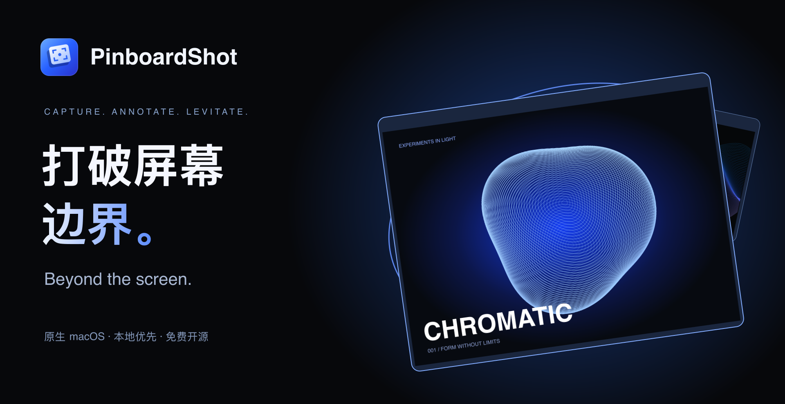

# PinboardShot

Capture, annotate, and pin images on macOS · macOS 截图、标注与贴图工具

[English](#english) · [中文](#中文) · [Website / 官网](https://pinboardshot.agentclub.dev) · [Download / 下载](https://github.com/agent-club/PinboardShot/releases/latest)

## English

PinboardShot is a free, open-source native macOS screenshot and pinboard app. Capture screen content, mark what matters, and keep the image above other windows so you can refer to documents, compare designs, or explain a problem without repeatedly switching windows.

The app lives in the menu bar without occupying the Dock. Captures, history, and default OCR are processed on your Mac. The interface supports Simplified Chinese, Traditional Chinese, and English.

### What you can use it for

- **Keep references in view**: pin a document excerpt, code snippet, or image beside your work.
- **Explain problems and share feedback**: add arrows, text, numbers, and highlights, then mask sensitive areas before copying or saving.
- **Compare designs and implementations**: view two pins side by side, or inspect details with difference and blend modes.
- **Organize long content and instructions**: capture scrolling content, edit long images, and turn screenshots and descriptions into exportable step documents.
- **Find earlier captures**: browse local history and enable OCR indexing to search for text inside images.

### Main features

| Feature | What you can do |
| --- | --- |
| Capture | Capture a region, display, or window; use a delay or repeat the last region; adjust selections precisely and choose output quality |
| Scrolling capture | Select content, scroll downward, and watch the stitched preview; use the optional Chrome extension for long web pages |
| Annotation and editing | Use mosaic, pen, shapes, numbers, highlights, arrows, and text; crop, rotate, undo, and redo |
| Text and recognition | Use on-device OCR, structured text and table output, QR recognition, color picking, and smart redaction |
| Desktop pins | Pin captures, clipboard images, or local files; resize, adjust opacity, lock positions, enable click-through, and control where pins appear |
| Pin workspaces | Add notes and tags, save and restore workspaces, compare images, and export images, PDF, or Markdown |
| History and boards | Set count and retention limits, search OCR text, and arrange captures into horizontal, vertical, or grid boards |
| Capture tools | Save editable annotation drafts, process long-image segments, create step documents, measure with a ruler, and record a silent region video for up to 60 seconds |
| Everyday controls | Configure global shortcuts, use macOS Shortcuts, launch at login, and check for in-app updates |

Scrolling capture needs overlap between adjacent views and pauses when it cannot confirm placement. Dynamic pages and complex scrolling areas may not be captured completely. Region recording currently includes neither audio nor GIF output. See the [release notes](https://github.com/agent-club/PinboardShot/releases) for features and limits in each version.

### Download and install

Requires **macOS 14 or later**, with both **Apple Silicon and Intel** architectures included.

1. Download the DMG from the [website](https://pinboardshot.agentclub.dev/en) or the [latest GitHub release](https://github.com/agent-club/PinboardShot/releases/latest).
2. Open the DMG, drag **PinboardShot** into **Applications**, and launch it from Applications.
3. Grant Screen Recording permission during onboarding, or enable it later in System Settings → Privacy & Security. If capture still fails after permission is granted, quit and reopen the app.

Official releases are Developer ID signed and Apple notarized. Existing users can check for updates from the menu or enable automatic checks in Settings.

### Get started

1. Click the PinboardShot menu-bar icon, choose Area Capture, and drag to select content.
2. Refine the selection using its edges or corners. Double-click to copy immediately, or use the toolbar to annotate, copy, or pin. Press `Esc` to cancel.
3. Drag a pin to move it; drag an edge or pinch with two fingers to resize proportionally. Right-click for options such as opacity and click-through.
4. Assign keys to frequent actions under Settings → Shortcuts. **Global shortcuts are disabled by default**, so you choose the combinations you need.

To pin an image already on the clipboard, choose Paste Clipboard Image. Restore interaction for click-through pins from Pin Management in the menu bar.

Chrome webpage capture is optional. Choose store installation or a local download in the app's settings; see the [usage guide](docs/chrome-extension.md) for installation steps and limits.

### Privacy and local data

- **Captures stay on your Mac**: the app contains no telemetry or analytics services. By default, it accesses the network only to check for and download software updates.
- **Text recognition is local by default**: history OCR indexing and smart redaction always remain on-device. Only when you explicitly configure and use a remote OCR plugin is the selected OCR region sent to your chosen service. API Keys stay in macOS Keychain. See the [OCR plugin guide](docs/ocr-plugins.md).
- **You control history**: configure count and retention limits, exclude selected source apps, clear history manually, or clear it when the app quits. Pin session recovery is off by default and can be enabled when needed.

Capture history is stored at `~/Library/Application Support/PinboardShot/History`. Read the [privacy policy](https://pinboardshot.agentclub.dev/privacy) and [security policy](SECURITY.md) for more information.

### Feedback and contributions

Report problems or suggest features through [GitHub Issues](https://github.com/agent-club/PinboardShot/issues). Follow the [security policy](SECURITY.md) for vulnerabilities, and remove sensitive content before sharing screenshots or logs.

To contribute code, documentation, or translations, read the [contribution guide](CONTRIBUTING.md#english). The project uses the [MIT license](LICENSE); third-party notices are in [NOTICE.md](NOTICE.md).

Thanks to the [linux.do](https://linux.do/) community for sharing ideas and feature requests that help improve PinboardShot.

## 中文

PinboardShot 是一款免费、开源的原生 macOS 截图与贴图工具。截取屏幕内容，标出重点，再把图片贴在其他窗口上方：查看参考资料、核对设计或说明问题时，不必反复切换窗口。

应用常驻菜单栏，不占用 Dock。截图、历史和默认 OCR 都在本机处理，界面支持简体中文、繁体中文和英文。

### 适合用来做什么

- **随手留住参考**：把文档片段、代码或图片贴在当前工作窗口旁边，边看边做。
- **说明问题与反馈**：用箭头、文字、编号和高亮标出重点，遮盖敏感区域后复制或保存。
- **核对设计与实现**：让两张贴图并排显示，或用差异、混合模式对比细节。
- **整理长内容和操作步骤**：截取滚动内容、处理长图，把截图与说明整理成可导出的步骤文档。
- **找回之前的截图**：浏览本地历史，开启 OCR 索引后按图片中的文字搜索。

### 主要功能

| 功能 | 可以做什么 |
| --- | --- |
| 截图 | 区域、屏幕、窗口、延迟截图和重复上次区域；支持精确调整选区与多档输出清晰度 |
| 滚动长截图 | 框选正文后向下滚动，实时查看拼接预览；可选 Chrome 插件用于网页长截图 |
| 标注与编辑 | 马赛克、画笔、形状、编号、高亮、箭头、文字，以及裁剪、旋转、撤销和重做 |
| 文字与识别 | 本机 OCR、结构化文字和表格输出、二维码识别、取色与智能脱敏 |
| 桌面贴图 | 从截图、剪贴板或本地图片创建贴图；缩放、透明度、锁定位置、鼠标穿透与显示范围设置 |
| 贴图工作区 | 为贴图添加备注与标签，保存和恢复工作区，比较图片，导出图片、PDF 或 Markdown |
| 历史与拼板 | 配置数量与保留期限，搜索 OCR 文字，将多张截图排成横向、纵向或网格拼板 |
| 截图工具 | 可编辑标注原稿、长图分段处理、步骤文档、标尺，以及最长 60 秒的无声区域录屏 |
| 日常操作 | 自定义全局快捷键、macOS 快捷指令、登录时启动和应用内更新 |

滚动截图需要保留相邻画面的重叠，无法确认拼接位置时会暂停；动态页面和复杂滚动区域可能无法完整采集。区域录屏目前不包含音频或 GIF。具体版本的功能与限制请查看[更新记录](https://github.com/agent-club/PinboardShot/releases)。

### 下载与安装

支持 **macOS 14 或更高版本**，包含 **Apple Silicon 与 Intel** 架构。

1. 从[官网](https://pinboardshot.agentclub.dev/zh)或 [GitHub 最新版本](https://github.com/agent-club/PinboardShot/releases/latest)下载 DMG。
2. 打开 DMG，将 **PinboardShot** 拖入 **Applications（应用程序）**，然后从应用程序目录启动。
3. 在首次启动引导中授予屏幕录制权限；也可以稍后在「系统设置 → 隐私与安全性」中开启。授权后如仍无法截图，退出并重新打开应用。

正式发布的应用使用 Developer ID 签名并通过 Apple 公证。已安装用户可从菜单检查更新，也可在设置中开启自动检查。

### 开始使用

1. 点击菜单栏中的 PinboardShot 图标，选择「区域截图」，拖动框选内容。
2. 拖动边缘或角落微调选区；双击选区可直接复制，也可在工具栏中标注、复制或贴屏。按 `Esc` 取消。
3. 拖动贴图移动位置，拖动边缘或双指捏合等比缩放；右键可调整透明度、鼠标穿透等选项。
4. 经常使用的动作可在「设置 → 快捷键」中绑定按键。**默认不启用全局快捷键**，由你选择需要的组合。

剪贴板中已有图片时，选择「粘贴剪贴板图片」即可贴屏。鼠标穿透开启后，可从菜单栏「贴图管理」恢复交互。

Chrome 网页长截图是可选功能，可在应用设置中选择商店安装或下载到本地；安装方法与限制见[使用说明](docs/chrome-extension.md)。

### 隐私与本地数据

- **截图留在本机**：应用不包含遥测或分析服务，默认仅为检查和下载软件更新访问网络。
- **文字识别默认在本机完成**：历史 OCR 索引与智能脱敏始终在本机执行。只有主动配置并使用远程 OCR 插件时，框选的 OCR 区域才会发送到你指定的服务；API Key 保存在 macOS 钥匙串中。详见 [OCR 插件说明](docs/ocr-plugins.md)。
- **历史由你管理**：可设置保留数量与期限、排除指定来源 App、手动清空或退出时自动清理。贴图会话恢复默认关闭，可按需开启。

截图历史位于 `~/Library/Application Support/PinboardShot/History`。更多信息见[隐私政策](https://pinboardshot.agentclub.dev/privacy)与[安全策略](SECURITY.md)。

### 反馈与贡献

欢迎通过 [GitHub Issues](https://github.com/agent-club/PinboardShot/issues)反馈问题或提出功能建议。涉及安全漏洞请按[安全策略](SECURITY.md)报告；分享截图或日志前请移除敏感内容。

想参与开发、改进文档或翻译，请阅读[贡献指南](CONTRIBUTING.md#中文)。项目采用 [MIT 许可证](LICENSE)，第三方组件说明见 [NOTICE.md](NOTICE.md)。

感谢 [linux.do](https://linux.do/) 社区分享思路、提出想法和需求，为 PinboardShot 的持续改进提供参考。
